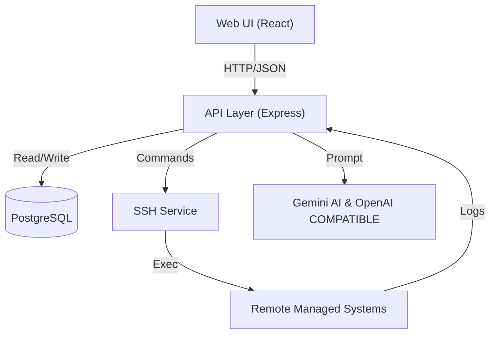
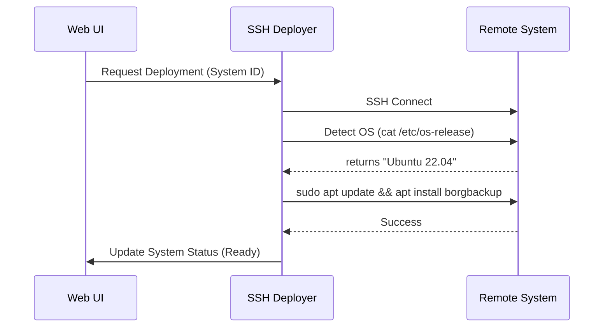
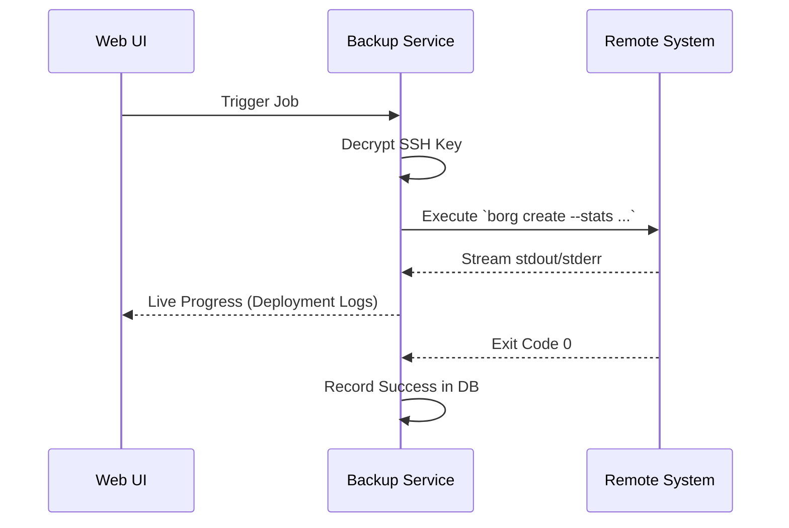

# 🏗️ Fortress System Architecture

This document describes the internal structure and communication flows of the Fortress Backup Manager.

## 🌉 High-Level Overview

Fortress is a distributed system designed to manage remote backups while keeping security and visibility at the forefront.

---

## 🏗️ Layered Architecture

### 1. Presentation Layer (Frontend)
- **React SPA**: A modern interface for infrastructure management.
- **State Management**: Local state handles real-time log updates via API polling/streaming.
- **API Client**: A centralized client handles authentication tokens and global error states.

### 2. Orchestration Layer (Backend Services)
The backend is divided into specialized services:
- **SSH Deployer**: Handles the "bootstrap" process of remote systems. It detects OS distributions and uses native package managers (`apt`, `dnf`, `pacman`) to install engines.
- **Backup Service**: A factory-based engine system that translates high-level "Backup Jobs" into specific CLI commands for Borg, Restic, or Rsync.
- **Job Scheduler**: Manages the execution timing and retry logic for configured backup tasks.

### 3. Data Persistence Layer
- **PostgreSQL**: Stores system metadata, SSH connection configurations, job history, and user sessions.
- **Credential Storage**: Uses AES-256-GCM to store SSH private keys securely in the database.

---

## 🔄 Core Workflows

### Deployment Flow
How Fortress prepares a new system for backups:

### Backup Execution Flow
How a backup job is processed:

---

## 🔒 Security Principles

1. **Agentless Architecture**: No proprietary agents are required on remote systems; Fortress uses standard SSH and trusted open-source tools.
2. **Minimal Privilege**: Recommended setup involves a dedicated `backup` user on remote systems with restricted `sudo` access to backup tools only.
3. **Decentralized Secrets**: Credentials are encrypted with a system-wide master key, ensuring that even with database access, keys remain protected.

---

## 🛠️ Internal Directory Structure

- `/server`: Backend source code.
    - `/db`: Database models and migrations.
    - `/routes`: API endpoint definitions.
    - `/services`: Core business logic (Deployment, Backup, Auth).
- `/services/api`: Frontend API client and communication logic.
- `/components`: Shared React UI components.
- `/data`: Local data stores and SQL files.
